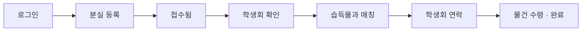
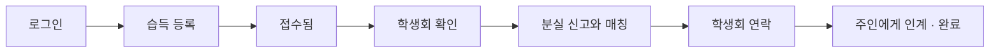
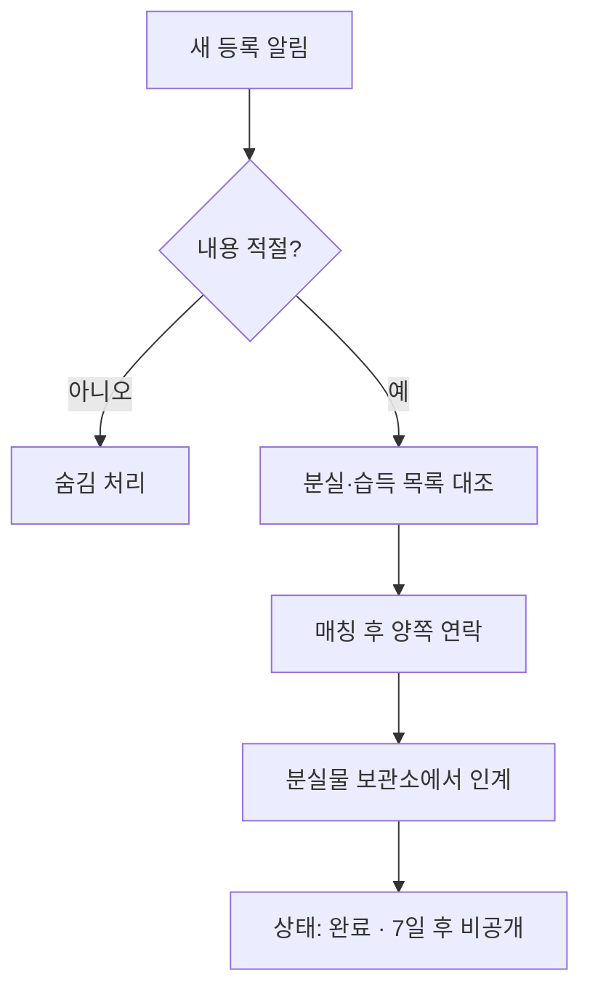

# PRD — 양벤져스 교내 분실물 센터

| 항목 | 내용 |
|------|------|
| 버전 | v1.1 (MVP) |
| 작성일 | 2026-07-05 |
| 대상 | 양벤져스 고등학교 학생·교직원 |
| 운영 주체 | 학생회 (분실물 담당) |

---

## 1. 배경 및 문제

교내에서 분실물을 **찾기 어렵고**, **신고하기도 어렵다**.

- 분실물 정보가 구두·게시판·단톡 등에 흩어져 있어 검색이 어렵다.
- 주인·습득자가 직접 연락하면 개인정보 노출·오해·사칭 등의 부담이 있다.
- 학생회가 중간에서 관리하더라도, 수기·비공식 채널로는 누락과 지연이 발생한다.

**해결 방향:** 스마트폰에서 바로 쓸 수 있는 **교내 전용 웹사이트**를 만들어, 등록 → 검색 → 학생회 중개 연락까지 한곳에서 처리한다.

---

## 2. 웹사이트가 적합한 이유

| 비교 | 웹사이트 (권장) | 네이티브 앱 |
|------|-----------------|-------------|
| 설치 | URL/QR만 공유하면 됨 | 스토어 심사·설치 부담 |
| 유지보수 | 한 번 수정하면 전원 반영 | iOS/Android 각각 관리 |
| 접근 | 스마트폰 브라우저로 즉시 사용 | 앱 설치 필요 |
| 비용·기간 | MVP 개발·배포가 빠름 | 상대적으로 무거움 |

**결론:** 주 사용 환경이 스마트폰이고, MVP(신고·목록·연락) 범위라면 **반응형 웹 + 홈 화면 추가(PWA, 선택)** 가 최적이다.

---

## 3. 목표

### 3.1 제품 목표 (MVP)

1. **5분 안에** 분실·습득 사실을 등록할 수 있다.
2. **키워드·분류**로 등록된 항목을 빠르게 찾을 수 있다.
3. **학생회가 중개**하여 주인과 습득자를 안전하게 연결한다.
4. **학교 구성원만** 접근할 수 있다.

### 3.2 성공 지표 (출시 후 1개월 기준, 목표치는 추후 확정)

| 지표 | 설명 |
|------|------|
| 주간 등록 건수 | 분실·습득 등록 합계 |
| 매칭 성공률 | `인계 완료` / 전체 등록 |
| 평균 처리 시간 | 등록 → 학생회 확인 → 연락까지 |
| 재방문율 | 같은 사용자의 2회 이상 접속 비율 |

---

## 4. 사용자 및 역할

| 역할 | 설명 | 주요 행동 |
|------|------|-----------|
| **일반 사용자** (학생·교직원) | 분실물을 잃거나 주웠을 때 | 등록, 검색, 내 글 확인 |
| **학생회 관리자** | 분실물 센터 운영 | 승인·상태 변경, 중개 연락, 부적절 글 처리 |
| **(향후) 슈퍼 관리자** | 필요 시 확장 | 관리자 계정 부여, 정책 설정 (MVP는 학생회 단독 운영) |

---

## 5. 정보 구조 (메뉴)

### 5.1 하단 탭 (모바일 기준, 4개)

```
┌─────────┬─────────┬─────────┬─────────┐
│  홈     │  찾기   │  등록   │  내 정보 │
└─────────┴─────────┴─────────┴─────────┘
```

| 탭 | 역할 |
|----|------|
| **홈** | 최근 습득·분실 요약, 빠른 검색, 이용 안내 |
| **찾기** | 전체 목록·필터·검색 |
| **등록** | 분실 신고 / 습득 신고 선택 후 작성 |
| **내 정보** | 내가 올린 글, 알림(향후), 로그아웃 |

### 5.2 학생회 관리자 전용

- 일반 탭 + **관리** 메뉴 (관리자 계정에만 표시)
- 하위: **대기 목록** · **처리 중** · **완료** · **부적절/숨김**

---

## 6. 화면별 UI/UX 요구사항

### 6.1 공통 UX 원칙

- **한 화면 한 가지 일:** 등록 폼은 스크롤 최소, 필수 입력만 강조
- **3탭 이내:** 홈 → 찾기 → 상세까지 깊이 3단계 이하
- **학교 톤:** 밝고 신뢰감 있는 색 (학교 로고·색상 확정 시 반영)
- **접근성:** 글자 크기 16px 이상, 버튼 터치 영역 44px 이상
- **오류 방지:** 등록 전 요약 확인, 연락처는 사용자에게 직접 노출하지 않음

### 6.2 홈

```
┌──────────────────────────────┐
│  양벤져스 분실물 센터          │
│  [ 🔍 무엇을 잃어버리셨나요? ]  │  ← 탭 시 찾기로 이동
├──────────────────────────────┤
│  [ 분실했어요 ]  [ 주웠어요 ]   │  ← 등록 탭으로 바로 이동
├──────────────────────────────┤
│  최근 습득물 (카드 3~5개)       │
│  · 에어팟 · 2층 복도 · 7/3     │
├──────────────────────────────┤
│  💡 이용 방법 (접기/펼치기)     │
│  1. 등록 → 2. 학생회 확인 →     │
│  3. 카톡 연락 → 4. 보관소 수령   │
└──────────────────────────────┘
```

### 6.3 찾기 (목록)

- **검색:** 제목·설명·장소 키워드
- **필터:** 유형(분실/습득), 분류, 날짜(최근 7일/30일)
- **정렬:** 최신순 (기본)
- **카드 정보:** 분류 아이콘, 한 줄 제목, 장소·날짜, 상태 뱃지 (`확인 중` / `연락 대기` / `완료`)

### 6.4 등록

**Step 1 — 유형 선택**

- `분실했어요` / `주웠어요`

**Step 2 — 정보 입력**

| 필드 | 필수 | 설명 |
|------|------|------|
| 제목 | O | 예: "검은색 에어팟 케이스" |
| 분류 | O | 전자기기 / 지갑·카드 / 의류 / 기타 |
| 장소 | O | 예: "2층 복도, 매점 앞" |
| 날짜·시간 | O | 분실·습득 시점 (대략 가능) |
| 설명 | O | 특징, 브랜드, 이름 등 (주인 확인용) |
| 사진 | X | 최대 3장, 선택 |
| 연락 가능 시간 | X | 학생회가 연락할 때 참고 |

**Step 3 — 확인 및 제출**

- "학생회가 확인 후 연락드립니다" 안내
- 제출 후 → **내 글 상세** + 상태 `접수됨`

> **개인정보:** 분실물 등록 폼에는 연락처를 받지 않음. 학생회는 **가입 시 등록한 카카오톡 ID**로만 연락하며, 타 사용자에게 노출하지 않음.

### 6.4.1 가입 · 로그인 (확정)

| 필드 | 필수 | 설명 |
|------|------|------|
| 학번 | O | **5자리 숫자** (학년/반/번호), 고유 ID, 중복 가입 불가 |
| 비밀번호 | O | 8자 이상 (영문+숫자 권장) |
| 이름 | O | 본인 확인용 (다른 사용자에게 비공개) |
| 카카오톡 ID | O | 학생회 중개 연락용 (다른 사용자에게 비공개) |

- **가입:** 학번 + 비밀번호 + 이름 + 카카오톡 ID
- **로그인:** 학번 + 비밀번호
- 학교 Google/Microsoft 계정 연동은 **사용하지 않음**

**학번 형식 (확정)**

| 자릿수 | 의미 | 예시 |
|--------|------|------|
| 1자리 | 학년 (1~3) | `1` = 1학년 |
| 2자리 | 반 (01~99) | `02` = 2반 |
| 2자리 | 번호 (01~99) | `15` = 15번 |

- 전체: **5자리 숫자**만 허용 (예: `10215` = 1학년 2반 15번)
- 가입 시 형식 검증: 숫자 5자리, 학년 1~3, 반·번호 01 이상
- 타 학교 학번·임의 숫자 가입 방지를 위해 형식 불일치 시 가입 불가

### 6.5 상세 보기

- 공개 정보: 제목, 분류, 장소, 날짜, 설명, 사진(있을 때), 상태
- **비공개:** 작성자 실명·연락처
- 일반 사용자: `이게 제 물건이에요` / `제가 주웠어요` 버튼 → 학생회에 **매칭 요청** 전송 (본인 글에는 비표시)
- 관리자: 상태 변경, 메모, 카카오톡으로 양쪽 연락 후 완료 체크, **분실물 보관소** 인계 안내

### 6.6 내 정보

- 내 등록 목록 (분실/습득 구분)
- 각 글 상태 타임라인:
  `접수됨 → 학생회 확인 중 → 연락 예정 → 인계 완료`
- (MVP 이후) 학생회 메시지 알림

### 6.7 관리자 — 대시보드

| 상태 | 의미 | 관리자 액션 |
|------|------|-------------|
| 접수됨 | 방금 등록됨 | 내용 검토 → `확인 중` |
| 확인 중 | 유효한 신고 | 매칭 후 `연락 대기` |
| 연락 대기 | 학생회가 양쪽 연락 중 | 인계 후 `완료` |
| 완료 | 해결됨 | 아카이브 |
| 숨김 | 부적절·중복·스팸 | 목록에서 제외 |

---

## 7. 핵심 사용자 흐름

### 7.1 분실자



### 7.2 습득자



### 7.3 학생회 (중개)



---

## 8. 기능 범위

### 8.1 MVP (1차 출시) — 포함

- [ ] 학교 구성원 전용 가입·로그인 (학번 5자리 + 비밀번호, 가입 시 카카오톡 ID)
- [ ] 분실 / 습득 등록 (사진 선택, 간단 분류)
- [ ] 목록·검색·필터
- [ ] 게시글 상세 및 상태 표시
- [ ] `매칭 요청` (학생회에게 알림)
- [ ] 학생회 관리자: 목록·상태 변경·숨김
- [ ] 반응형 모바일 UI

### 8.2 MVP — 제외 (2차 이후)

- 실시간 채팅
- 푸시 알림 (PWA 또는 카카오 알림톡 등)
- AI 이미지 유사도 매칭
- 다국어
- 통계 대시보드 (고급)
- 교사용 슈퍼 관리자

---

## 9. 비기능 요구사항

| 항목 | 요구 |
|------|------|
| **보안** | HTTPS, 세션/토큰 만료, 관리자 권한 분리 |
| **개인정보** | 연락처 미수집·미노출, 사진 EXIF 위치 정보 제거 |
| **성능** | 목록 첫 로딩 3초 이내 (일반 교내 네트워크 기준) |
| **가용성** | 학교 서버 또는 클라우드 무료/저비용 티어 (추후 결정) |
| **운영** | 학기 중 장애 시 학생회 카카오톡·분실물 보관소 안내 병행 |

---

## 10. 콘텐츠·정책

- 부적절한 사진·허위 신고 시 **숨김** 및 학교 생활 규정에 따른 조치 (문구는 학교·학생회와 협의)
- **목록 보관 기간:** `완료` 처리 후 **7일** 뒤 일반 목록에서 비공개 (관리자는 조회 가능)
- **실물 보관:** 주운 물건은 **분실물 보관소**에 보관 후, 주인 확인 시 인계
- 중복 등록은 관리자가 통합

---

## 11. 기술 방향 (제안, 확정 전)

| 레이어 | 제안 | 비고 |
|--------|------|------|
| 프론트 | React 또는 Next.js + Tailwind | 모바일 UI 빠른 구현 |
| 백엔드 | Supabase 또는 Firebase | 인증·DB·파일 저장 통합 |
| 배포 | Vercel + Supabase | 학생 프로젝트에 적합 |
| 인증 | **학번 + 비밀번호** 자체 가입 | 카카오톡 ID는 프로필 필드로 저장 |

> 기술 스택은 팀 역량에 맞게 변경 가능. PRD의 **동작·화면·역할**이 우선이다.

---

## 12. 마일스톤 (제안)

| 단계 | 기간(예) | 산출물 |
|------|----------|--------|
| 1. 기획 확정 | 1주 | PRD v1.0, 와이어프레임 |
| 2. 디자인 | 1주 | 홈·등록·목록·관리 화면 목업 |
| 3. MVP 개발 | 2~3주 | 로그인, CRUD, 관리자 |
| 4. 시범 운영 | 2주 | 1학년 또는 친구 그룹 테스트 |
| 5. 전교 확대 | - | QR 포스터, 학생회 공지 |

---

## 13. 리스크 및 대응

| 리스크 | 대응 |
|--------|------|
| 가짜 학번 가입 | 5자리 형식 검증 (학년 1~3) + 학생회 수동 확인(필요 시) |
| 허위·장난 등록 | 관리자 승인 후 공개 또는 숨김 정책 |
| 사용률 저조 | 교내 QR·아침 방송·담임 공지 병행 |
| 개인정보 우려 | 연락 중개·최소 수집 원칙을 UI에 명시 |

---

## 14. 확정 사항 (Stakeholder)

| # | 항목 | 확정 내용 |
|---|------|----------|
| 1 | **로그인 방식** | 학번 + 비밀번호 가입 (학교 계정 연동 없음) |
| 2 | **학생회 연락 채널** | **카카오톡** (가입 시 등록한 ID로 학생회가 1:1 연락) |
| 3 | **실물 보관 장소** | **분실물 보관소** |
| 4 | **완료 후 목록 보관** | **7일** 후 일반 목록 비공개 |
| 5 | **운영·승인** | **학생회** 단독 운영 (교사·교감 공식 승인 불필요) |
| 6 | **학번 형식** | **5자리 숫자** = 학년(1) + 반(2) + 번호(2), 예: `10215` |

### 14.1 확인 필요 (잔여)

| # | 질문 | 비고 |
|---|------|------|
| 6 | **팀 구성** — 개발 인원, 사용할 언어/프레임워크 | 추후 결정 |
| 7 | **분실물 보관소 위치·운영 시간** | 홈/안내 문구에 표시 예정 |

---

## 15. 부록 — 와이어프레임 텍스트 (등록 플로우)

```
[ 등록 탭 ]

  무엇을 등록할까요?
  ┌──────────────┐  ┌──────────────┐
  │  😢 분실      │  │  🎁 습득      │
  └──────────────┘  └──────────────┘

        ↓ (분실 선택 시)

  제목: [________________]
  분류: (●)전자 ( )지갑 ( )의류 ( )기타
  장소: [________________]
  날짜: [ 7/3 ▼ ]  시간: [ 점심시간 ▼ ]
  설명: [________________________]
  사진: [ + 추가 (선택) ]

  ⓘ 연락처는 여기 입력하지 않습니다.
     학생회가 가입 시 등록한 카톡으로 연락합니다.
     주운 물건은 분실물 보관소에서 수령합니다.

        [ 등록하기 ]
```

---

## 16. 문서 이력

| 버전 | 날짜 | 변경 |
|------|------|------|
| v0.1 | 2026-07-05 | 초안 — MVP 범위, 메뉴, 흐름, 미확정 항목 정리 |
| v1.0 | 2026-07-05 | 로그인·연락·보관소·보관기간·운영 주체 확정 |
| v1.1 | 2026-07-05 | 학번 형식 확정 (학년/반/번호 5자리) |
